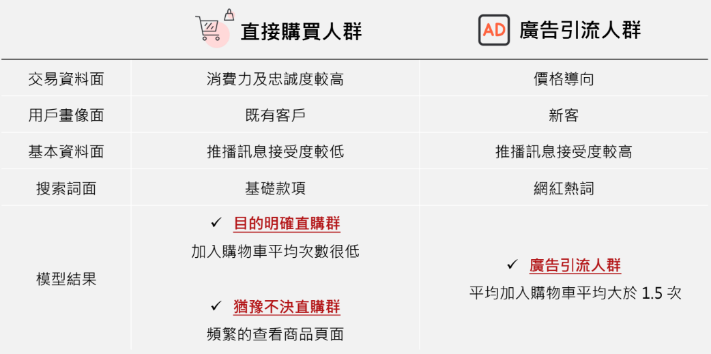
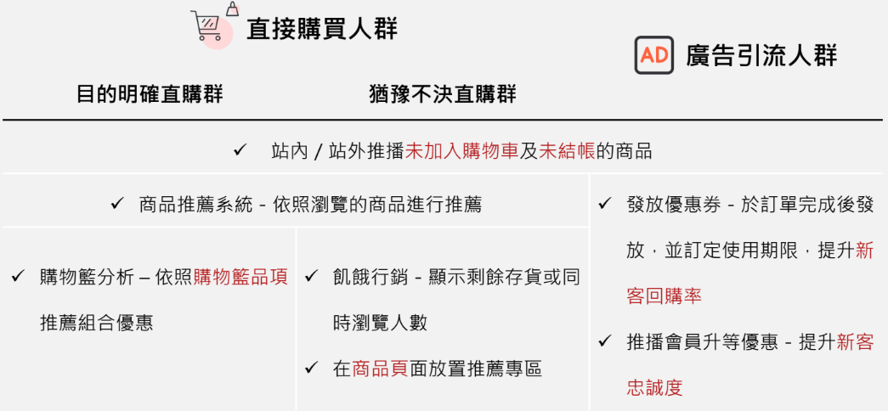

# 線上購買受到廣告影響的人群分析
碩一下 大數據與商業分析 期末專案

## Motivation
商家透過投放線上廣告,期望提升顧客的購買意圖,但廣告活動對於每位顧客的影響程度都有所差異。若能深入了解不同影響程度的客群,便有機會優化廣告投放的成效。

## Objective
此研究想探討線上購買的用戶中,「受廣告強烈影響」與「無受廣告影響」兩種客群的消費習慣與用戶屬性,並且運用模型驗證這兩種客群的有效差異特徵。

## Methodology
1. 選取研究樣本主體
2. 選定分析人群
3. EDA檢視分群差異
4. 分群貼標模型預測(使用 Decision Tree)

## Conclusion
:dart:**廣告投放對人群的購買意圖有顯著影響**

## Marketing Strategy

## 相關文件
[完整簡報檔](https://drive.google.com/file/d/1rpjy2cusVxx8aer7JHt1DBo-kq3dpE-z/view?usp=sharing)